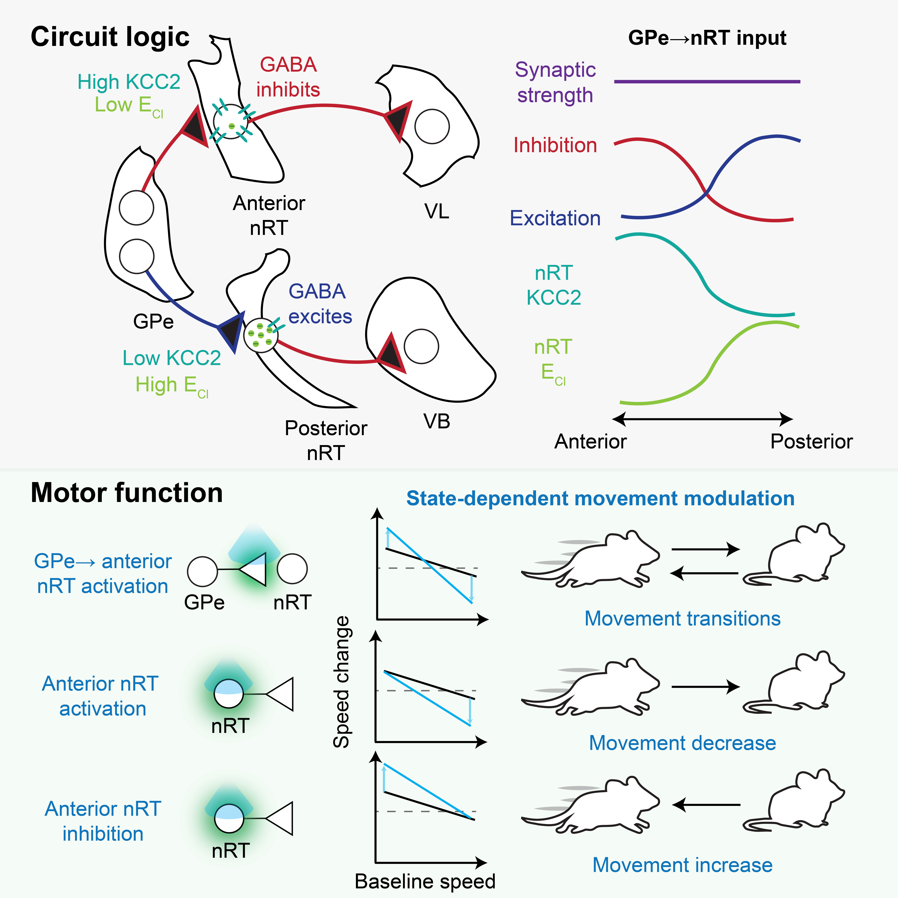

# GPe–nRT Project Repository


## Overview

This repository contains all code, processed data, DLC network assoociated with the manuscript:

**“A non-canonical pallidothalamic pathway for motor control”**

The goal is to ensure that every figure panel in the manuscript can be directly reproduced from the materials in the repository. All code was written by Isaac Chang. Raw data could be downloaded from Zenodo: https://zenodo.org/records/20583270

## Repository Structure

```text
GPe/
│
├── README.md
│
├── Code/
│   ├── DLC/
│   ├── Fiber/
│   ├── Opto/
│   └── Patch/
│
├── Data/
│   ├── Fiber/
│       ├── Analysis/
│       ├── Preprocessing/
│           ├── Fiber
│           └── Mvt
│       └── Raw DLC trajectories/(On Zenodo)
│   ├── IHC/
│       └── KCC2/  
│   ├── Opto/
│       ├── Analysis/
│       ├── LMM/
│       └── Raw DLC trajectories/(On Zenodo)  
│   ├── Patch/
│   └── Supp/
└── DLC/
```
## Figures
### Fig 1
```text
A. -----
B. -----
C. Patch/PSCSingleMinStim.py, Patch/PSCPrMinStim.py
D. Patch/PSCHz.py
E. Patch/Map.py
```
### Fig 2
```text
A. -----
B. Patch/CellAttached.py
C. -----
D. Patch/Map.py
E. -----
F. Patch/DrugWashOn.py
```
### Fig 3
```text
A. Patch/IVCurveNRTPP.py, Patch/MemTestForever.py
B. Patch/Map.py
C. -----
D. Patch/BriefFiring.py
E. Patch/IVCurveNRT.py
F. Patch/BreifPSP.py

```
### Fig 4
```text
A. -----
B. Patch/BriefFiring.py
C. -----
```
### Fig 5
```text
1. Markerless pose estimation: DLC/filter.py → DLC/process.py
2. Processing of TDT fiberphotometry and synchronization with movement dat: Fiber/preprocess.py
3. Analysis: Fiber/Single.py, Fiber/Population.py
```
### Fig 6
```text
1. Markerless pose estimation: DLC/filter.py → DLC/process.py
2. Analysis: Opto/Single.py, Opto/Population.py, Opto/LMM.py
```
### Fig 7
```text
1. Markerless pose estimation: DLC/filter.py → DLC/process.py
2. Analysis: Opto/Single.py, Opto/Population.py, Opto/LMM.py
```
### Supp Fig 1 
```text
A. -----
B. -----
C. Patch/PSCPrMinStim.py
D. -----
```
### Supp Fig 2
```text
1. Markerless pose estimation: DLC/filter.py → DLC/process.py
2. Processing of TDT fiberphotometry and synchronization with movement dat: Fiber/preprocess.py
3. Analysis: Fiber/Single.py, Fiber/Population.py
```
### Supp Fig 3
```text
1. Markerless pose estimation: DLC/filter.py → DLC/process.py
2. Analysis: Opto/Single.py, Opto/Population.py, Opto/LMM.py
```
### Supp Fig 4
```text
1. Markerless pose estimation: DLC/filter.py → DLC/process.py
2. Analysis: Opto/Single.py, Opto/Population.py, Opto/LMM.py
```
### Supp Fig 5
```text
A. -----
B. Patch/OpsinFiring.py, Patch/OpsinSilent.py
```

## Contact

For questions, please contact Isaac Chang at isaachkchang@gmail.com

## Citation

If using this repository, please cite: https://www.biorxiv.org/content/10.64898/2026.06.08.730902v1
